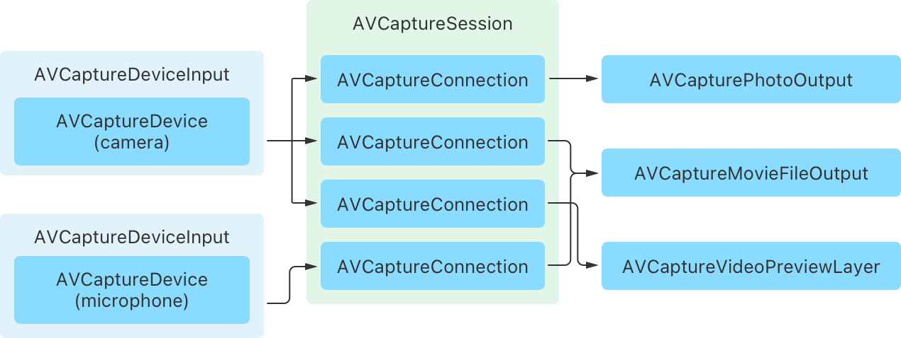

# AVCam: Building a camera app
Capture photos and record video using the front and rear iPhone and iPad cameras.

## Overview
The AVCam sample shows you how to build a basic camera app for iOS. It demonstrates how to use AVFoundation to access device cameras and microphones, configure a capture session, capture photos and videos, and much more. It also shows how to use the [PhotoKit](https://developer.apple.com/documentation/photokit) framework to save your captured media to the Photos library.

The sample uses SwiftUI and the features of Swift concurrency to build a responsive camera app. The following diagram describes the app’s design:


The key type the app defines is `CaptureService`, an actor that manages the interactions with the AVFoundation capture APIs. This object configures the capture pipeline and manages its life cycle, and defines an asynchronous interface to capture photos and videos. It delegates the handling of those operations to the app’s `PhotoCapture` and `MovieCapture` objects, respectively.

- Note: Configuring and starting a capture session are blocking operations that can take time to complete. To keep the user interface responsive, the app defines `CaptureService` as an actor type to ensure that AVFoundation capture API calls don’t occur on the main thread.

## Configure the sample code project
Because Simulator doesn't have access to device cameras, it isn't suitable for running the app—you'll need to run it on a device. To run this sample, you'll need the following:
* An iOS device with iOS 18 or later

## Configure a capture session
The central object in any capture app is an instance of [AVCaptureSession](https://developer.apple.com/documentation/avfoundation/avcapturesession). A capture session is the central hub to which the app connects inputs from camera and microphone devices, and attaches them to outputs that capture media like photos and video. After configuring the session, the app uses it to control the flow of data through the capture pipeline.



The capture service performs the session configuration in its `setUpSession()` method.
It retrieves the default camera and microphone for the host device and adds them as inputs to the capture session.

```swift
// Retrieve the default camera and microphone.
let defaultCamera = try deviceLookup.defaultCamera
let defaultMic = try deviceLookup.defaultMic

// Add inputs for the default camera and microphone devices.
activeVideoInput = try addInput(for: defaultCamera)
try addInput(for: defaultMic)
```

To add the inputs, it uses a helper method that creates a new [AVCaptureDeviceInput](https://developer.apple.com/documentation/avfoundation/avcapturedeviceinput) for the specified camera or microphone device and adds it to the capture session, if possible.

```swift
// Adds an input to the capture session to connect the specified capture device.
@discardableResult
private func addInput(for device: AVCaptureDevice) throws -> AVCaptureDeviceInput {
    let input = try AVCaptureDeviceInput(device: device)
    if captureSession.canAddInput(input) {
        captureSession.addInput(input)
    } else {
        throw CameraError.addInputFailed
    }
    return input
}
```

After adding the device inputs, the method configures the capture session for the app’s default photo capture mode. It optimizes the pipeline for high-resolution photo quality output by setting the capture session’s [.photo](https://developer.apple.com/documentation/avfoundation/avcapturesession/preset/1390112-photo) preset. Finally, to enable the app to capture photos, it adds an [AVCapturePhotoOutput](https://developer.apple.com/documentation/avfoundation/avcapturephotooutput) instance to the session.

```swift
// Configure the session for photo capture by default.
captureSession.sessionPreset = .photo

// Add the photo capture output as the default output type.
if captureSession.canAddOutput(photoCapture.output) {
    captureSession.addOutput(photoCapture.output)
} else {
    throw CameraError.addOutputFailed
}
```


## Set up a capture preview
To preview the content a camera is capturing, AVFoundation provides a Core Animation layer subclass called  [AVCaptureVideoPreviewLayer](https://developer.apple.com/documentation/avfoundation/avcapturevideopreviewlayer). SwiftUI doesn’t support using layers directly, so instead, the app hosts this layer in a [UIView](https://developer.apple.com/documentation/uikit/uiview) subclass called `PreviewView`. It overrides the [layerClass](https://developer.apple.com/documentation/uikit/uiview/1622626-layerclass ) property to make the preview layer the backing for the view.

```swift
class PreviewView: UIView, PreviewTarget {
    
    // Use `AVCaptureVideoPreviewLayer` as the view's backing layer.
    override class var layerClass: AnyClass {
        AVCaptureVideoPreviewLayer.self
    }
    
    var previewLayer: AVCaptureVideoPreviewLayer {
        layer as! AVCaptureVideoPreviewLayer
    }
    
    func setSession(_ session: AVCaptureSession) {
        // Connects the session with the preview layer, which allows the layer
        // to provide a live view of the captured content.
        previewLayer.session = session
    }
}
```

To make this view accessible to SwiftUI, the app wraps it as a [UIViewRepresentable](https://developer.apple.com/documentation/swiftui/uiviewrepresentable) type called `CameraPreview`.

```swift
struct CameraPreview: UIViewRepresentable {
    
    private let source: PreviewSource
    
    init(source: PreviewSource) {
        self.source = source
    }
    
    func makeUIView(context: Context) -> PreviewView {
        let preview = PreviewView()
        // Connect the preview layer to the capture session.
        source.connect(to: preview)
        return preview
    }
    
    func updateUIView(_ previewView: PreviewView, context: Context) {
        // No implementation needed.
    }
}
```

To connect the preview to the capture session without directly exposing the capture service’s protected state, the sample defines app-specific `PreviewSource` and `PreviewTarget` protocols. The app passes the `CameraPreview` a preview source, which provides a reference to the capture session. Calling the preview source’s `connect(to:)` method sets the capture session on the `PreviewView` instance.

## Request authorization
The initial capture configuration is complete, but before the app can successfully start the capture session, it needs to determine whether it has authorization to use device inputs. The system requires that a person explicitly authorize the app to capture input from cameras and microphones. To determine the app’s status, the capture service defines an asynchronous `isAuthorized` property as follows:

```swift
var isAuthorized: Bool {
    get async {
        let status = AVCaptureDevice.authorizationStatus(for: .video)
        // Determine whether a person previously authorized camera access.
        var isAuthorized = status == .authorized
        // If the system hasn't determined their authorization status,
        // explicitly prompt them for approval.
        if status == .notDetermined {
            isAuthorized = await AVCaptureDevice.requestAccess(for: .video)
        }
        return isAuthorized
    }
}
```

The property’s implementation uses the methods of [AVCaptureDevice](https://developer.apple.com/documentation/avfoundation/avcapturedevice) to check the current status, and if the app hasn’t made a determination, requests authorization from the user. If the app has authorization, it starts the capture session to begin the flow of data. If not, it shows an error message in the user interface.

To learn more about the configuration required to access cameras and microphones, see [Requesting authorization to capture and save media](https://developer.apple.com/documentation/avfoundation/capture_setup/requesting_authorization_to_capture_and_save_media).


## Change the capture mode
The app starts in photo capture mode. Changing modes requires a reconfiguration of the capture session as follows:

```swift
func setCaptureMode(_ captureMode: CaptureMode) throws {
    
    self.captureMode = captureMode
    
    // Change the configuration atomically.
    captureSession.beginConfiguration()
    defer { captureSession.commitConfiguration() }
    
    // Configure the capture session for the selected capture mode.
    switch captureMode {
    case .photo:
        // The app needs to remove the movie capture output to perform Live Photo capture.
        captureSession.sessionPreset = .photo
        captureSession.removeOutput(movieCapture.output)
    case .video:
        captureSession.sessionPreset = .high
        try addOutput(movieCapture.output)
    }

    // Update the advertised capabilities after reconfiguration.
    updateCaptureCapabilities()
}
```

In photo capture mode, the app sets the [.photo](https://developer.apple.com/documentation/avfoundation/avcapturesession/preset/1390112-photo) preset on the capture session, which optimizes the capture pipeline for high-quality photo output. It also removes the movie capture output, which prevents the photo output from performing Live Photo capture. In video capture mode, it sets the session preset to [.high](https://developer.apple.com/documentation/avfoundation/avcapturesession/preset/1388084-high) and adds the movie file capture output to the session.

## Select a new camera
The app provides a button that lets people switch between the front and back cameras and, in iPadOS, connected external cameras. To change the active camera, the app reconfigures the session as follows:

```swift
// Changes the device the service uses for video capture.
private func changeCaptureDevice(to device: AVCaptureDevice) {
    // The service must have a valid video input prior to calling this method.
    guard let currentInput = activeVideoInput else { fatalError() }
    
    // Bracket the following configuration in a begin/commit configuration pair.
    captureSession.beginConfiguration()
    defer { captureSession.commitConfiguration() }
    
    // Remove the existing video input before attempting to connect a new one.
    captureSession.removeInput(currentInput)
    do {
        // Attempt to connect a new input and device to the capture session.
        activeVideoInput = try addInput(for: device)
        // Configure a new rotation coordinator for the new device.
        createRotationCoordinator(for: device)
        // Register for device observations.
        observeSubjectAreaChanges(of: device)
        // Update the service's advertised capabilities.
        updateCaptureCapabilities()
    } catch {
        // Reconnect the existing camera on failure.
        captureSession.addInput(currentInput)
    }
}
```

[AVCaptureSession](https://developer.apple.com/documentation/avfoundation/avcapturesession) only allows attaching a single camera input at a time, so this method begins by removing the existing camera’s input. It then attempts to add an input for the new device and, if successful, performs some internal configuration to reflect the device change. If the capture session can’t add the new device, it reconnects the removed input.

- Note: If your app requires capturing from multiple cameras simultaneously, use [AVCaptureMultiCamSession](https://developer.apple.com/documentation/avfoundation/avcapturemulticamsession) instead.

## Capture a photo
The capture service delegates handling of the app’s photo capture features to the `PhotoCapture` object, which manages the life cycle of and interaction with an [AVCapturePhotoOutput](https://developer.apple.com/documentation/avfoundation/avcapturephotooutput). The app captures photos with this object by calling its [capturePhoto(with:delegate:)](https://developer.apple.com/documentation/avfoundation/avcapturephotooutput/1648765-capturephoto) method, passing it an object that describes photo capture settings to enable and a delegate for the system to call as capture proceeds. To use this delegate-based API in an `async` context , the app wraps this call with a checked throwing continuation as follows:

```swift
/// The app calls this method when the user taps the photo capture button.
func capturePhoto(with features: EnabledPhotoFeatures) async throws -> Photo {
    // Wrap the delegate-based capture API in a continuation to use it in an async context.
    try await withCheckedThrowingContinuation { continuation in
        
        // Create a settings object to configure the photo capture.
        let photoSettings = createPhotoSettings(with: features)
        
        let delegate = PhotoCaptureDelegate(continuation: continuation)
        monitorProgress(of: delegate)
        
        // Capture a new photo with the specified settings.
        photoOutput.capturePhoto(with: photoSettings, delegate: delegate)
    }
}
```

When the system finishes capturing a photo, it calls the delegate’s [photoOutput(_:didFinishCaptureFor:error:)](https://developer.apple.com/documentation/avfoundation/avcapturephotocapturedelegate/1778618-photooutput) method. The delegate object’s implementation of this method uses the continuation to resume execution by returning a photo or throwing an error.

```swift
func photoOutput(_ output: AVCapturePhotoOutput, didFinishCaptureFor resolvedSettings: AVCaptureResolvedPhotoSettings, error: Error?) {

    // If an error occurs, resume the continuation by throwing an error, and return.
    if let error {
        continuation.resume(throwing: error)
        return
    }
    
    /// Create a photo object to save to the `MediaLibrary`.
    let photo = Photo(data: photoData, isProxy: isProxyPhoto, livePhotoMovieURL: livePhotoMovieURL)
    // Resume the continuation by returning the captured photo.
    continuation.resume(returning: photo)
}
```

To learn more about capturing photos with AVFoundation, see [Capturing Still and Live Photos](https://developer.apple.com/documentation/avfoundation/photo_capture/capturing_still_and_live_photos).

## Record a movie
The capture service delegates handling of the app’s video capture features to the `MovieCapture` object, which manages the life cycle of and interaction with an [AVCaptureMovieFileOutput](https://developer.apple.com/documentation/avfoundation/avcapturemoviefileoutput). To start recording a movie, the app calls the movie file output’s [startRecording(to:recordingDelegate:)](https://developer.apple.com/documentation/avfoundation/avcapturefileoutput/1387224-startrecording) method, which takes a URL to write the move to and a delegate for the system to call when recording completes.

```swift
/// Starts movie recording.
func startRecording() {
    // Return early if already recording.
    guard !movieOutput.isRecording else { return }

    // Start a timer to update the recording time.
    startMonitoringDuration()
    
    delegate = MovieCaptureDelegate()
    movieOutput.startRecording(to: URL.movieFileURL, recordingDelegate: delegate!)
}
```

To finish recording the video, the app calls the movie file output’s [stopRecording()](https://developer.apple.com/documentation/avfoundation/avcapturefileoutput/1389485-stoprecording) method, which causes the system to call the delegate to handle the captured output. To adapt this delegate-based callback, the app wraps this interaction in a checked throwing continuation as follows:

```swift
/// Stops movie recording.
/// - Returns: A `Movie` object that represents the captured movie.
func stopRecording() async throws -> Movie {
    // Use a continuation to adapt the delegate-based capture API to an async interface.
    return try await withCheckedThrowingContinuation { continuation in
        // Set the continuation on the delegate to handle the capture result.
        delegate?.continuation = continuation
        
        /// Stops recording, which causes the output to call the `MovieCaptureDelegate` object.
        movieOutput.stopRecording()
        stopMonitoringDuration()
    }
}
```

When the app calls the movie file output’s [stopRecording()](https://developer.apple.com/documentation/avfoundation/avcapturefileoutput/1389485-stoprecording) method, the system calls the delegate, which resumes execution either by returning a movie or throwing an error.

```swift
func fileOutput(_ output: AVCaptureFileOutput, didFinishRecordingTo outputFileURL: URL, from connections: [AVCaptureConnection], error: Error?) {
    if let error {
        // If an error occurs, throw it to the caller.
        continuation?.resume(throwing: error)
    } else {
        // Return a new movie object.
        continuation?.resume(returning: Movie(url: outputFileURL))
    }
}
```
